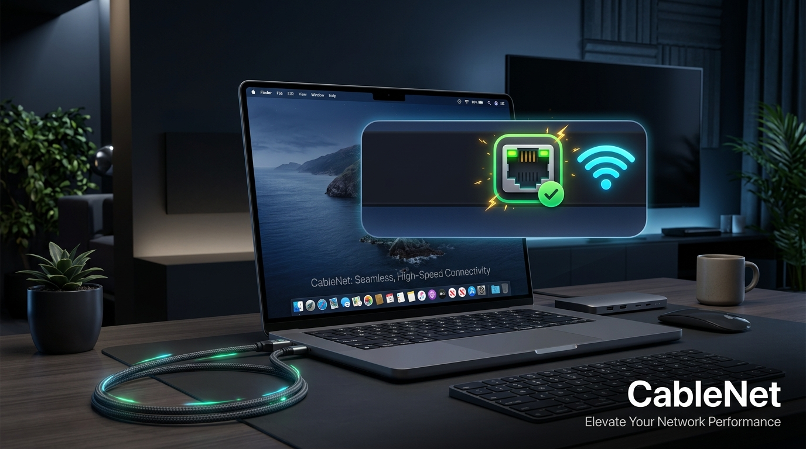
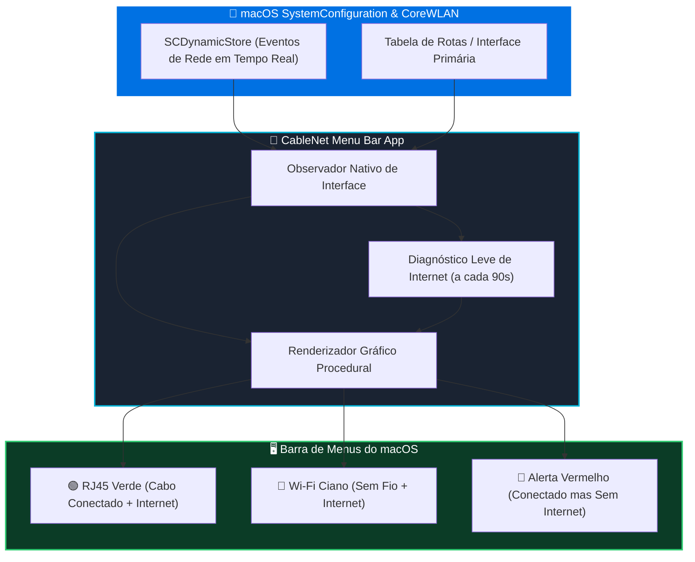

# 🔌 CableNet

<div align="center">



### O monitor inteligente de conexão Ethernet e Wi-Fi na barra de menus do macOS

[](https://github.com/WennyLife/CableNet)
[-6f42c1?style=for-the-badge)](https://github.com/WennyLife/CableNet)
[](https://github.com/WennyLife/CableNet)
[](LICENSE)
[](https://github.com/WennyLife/CableNet)

<br/>

### 🚀 **Clique abaixo para baixar a versão mais recente:**

[](https://github.com/WennyLife/CableNet/raw/main/release/CableNet-1.0.11.dmg)
&nbsp;
[](https://github.com/WennyLife/CableNet/raw/main/release/CableNet-1.0.11.zip)

<br/>

</div>

---

## 💡 O que é o CableNet?

O **CableNet** é um utilitário leve e minimalista criado exclusivamente para o ecossistema macOS. Ele vive silenciosamente na sua Barra de Menus e monitora em tempo real a interface de rede ativa do seu Mac.

Se você usa docks, adaptadores USB-C/Thunderbolt ou cabos RJ45 conectados ao seu Mac, frequentemente o macOS pode continuar usando o Wi-Fi sem que você perceba — ou vice-versa. Com o **CableNet**, basta um bater de olhos na barra superior para ter certeza de qual interface está transportando seus dados.

---

## ✨ Principais Funcionalidades

* 🌐 **Detecção Automática da Interface Ativa:**
  * **Cabo de Rede (RJ45):** Ícone RJ45 característico com indicador verde brilhante quando a rota principal for Ethernet.
  * **Wi-Fi:** Ícone de ondas de sinal ciano suave quando conectado à rede sem fio.
  * **Outras Conexões / Offline:** Ícone discreto em tom neutro/cinza quando desconectado ou em interfaces alternativas (ex.: VPN).
* 🩺 **Diagnóstico Ativo de Internet:**
  * Realiza checagens periódicas e ultraleves (a cada 90s) contra pontos de verificação de alta disponibilidade da Apple.
  * **Alerta Visual Imediato:** Ícone ou ponto vermelho caso a rede local esteja conectada mas sem acesso real à internet.
  * **Status de Verificação:** Ponto amarelo transitório durante o teste de resposta.
* ✨ **Animações Nativas & Respeito à Acessibilidade:**
  * Efeito sutil ao passar o cursor ou ao alternar interfaces (raios amarelos no conector RJ45 e ondas de sinal no Wi-Fi).
  * Sem pulos ou saltos na barra de menus: layout estável com geometria fixa.
  * Respeita integralmente a preferência de sistema **Reduzir Movimento** (*Reduce Motion*) do macOS.
  * Opção direta no menu para desativar animações a qualquer momento.
* 🚀 **Inicialização Opcional com o Sistema:**
  * Configure com um único clique no menu para abrir automaticamente ao ligar ou reiniciar o Mac (usando a API moderna `ServiceManagement`).
* 🔒 **Privacidade Absoluta (Zero Rastreamento):**
  * Sem anúncios, sem SDKs de terceiros, sem coleta de dados pessoais, identificadores de máquina ou histórico de tráfego.
  * App 100% autônomo e de código aberto.

---

## 📐 Como o CableNet Funciona



---

## 🎨 Guia de Estados Visuais

| Ícone | Interface Ativa | Conexão com a Internet | Descrição |
|:---:|:---:|:---:|:---|
| 🟢 🔌 | **Ethernet (RJ45)** | ✅ Online | Conexão cabeada ativa com velocidade e estabilidade máxima. |
| 🟡 🔌 | **Ethernet (RJ45)** | ⏳ Testando | Validando conectividade externa com a internet. |
| 🔴 🔌 | **Ethernet (RJ45)** | ❌ Sem Internet | Cabo conectado à rede local, porém sem saída para a internet. |
| 🔵 📶 | **Wi-Fi** | ✅ Online | Tráfego roteado pela interface de rede sem fio. |
| 🔴 📶 | **Wi-Fi** | ❌ Sem Internet | Conectado ao roteador Wi-Fi, porém sem acesso externo. |
| ⚪ 🔌 | **Desconectado / Outra** | — | Nenhuma rota padrão identificada ou adaptador desconectado. |

---

## 📥 Instalação

1. Baixe a versão mais recente: **[`CableNet-1.0.11.dmg`](https://github.com/WennyLife/CableNet/raw/main/release/CableNet-1.0.11.dmg)**.
2. Dê um duplo clique no arquivo `.dmg` montado.
3. Arraste o ícone do **CableNet** para a pasta **Aplicativos** (`/Applications`).
4. Abra o **CableNet** via Spotlight (`Cmd + Espaço`) ou pelo Launchpad.
5. O ícone aparecerá imediatamente na sua **Barra de Menus** (canto superior direito perto do relógio).

> [!NOTE]
> Por ser um utilitário exclusivo de barra de menus (`LSUIElement = true`), o CableNet não polui o seu Dock nem abre janelas flutuantes desnecessárias.

---

## 🛠️ Compilação a partir do Código-Fonte

O CableNet foi desenvolvido inteiramente em **Swift nativo** e não requer o Xcode completo para ser compilado — apenas as ferramentas de linha de comando (`Command Line Tools`) da Apple.

### Clonar o repositório:
```bash
git clone https://github.com/WennyLife/CableNet.git
cd CableNet
```

### Compilar o pacote universal (arm64 + x86_64):
```bash
bash src/build.sh
```

O script gerará automaticamente:
* Binário universal para Apple Silicon (M1/M2/M3/M4) e processadores Intel.
* Geração procedural dos ícones em todas as resoluções (`.icns` e `.iconset`).
* Criação da estrutura de pacote `CableNet.app`.
* Assinatura ad-hoc de runtime do macOS.

---

## 💻 Requisitos de Sistema

* **macOS:** 13.0 (Ventura) ou superior (macOS Sonoma, macOS Sequoia testados).
* **Processador:** Apple Silicon (M1, M2, M3, M4) ou Intel 64-bit.
* **Permissões:** Nenhuma permissão especial de acessibilidade ou kernel extension é necessária.

---

## 📄 Licença

Este projeto é distribuído sob os termos da licença **MIT**. Consulte o arquivo [LICENSE](LICENSE) para mais detalhes.

---

<div align="center">
Desenvolvido com carinho por <a href="https://github.com/WennyLife"><strong>WennyLife</strong></a>
</div>
